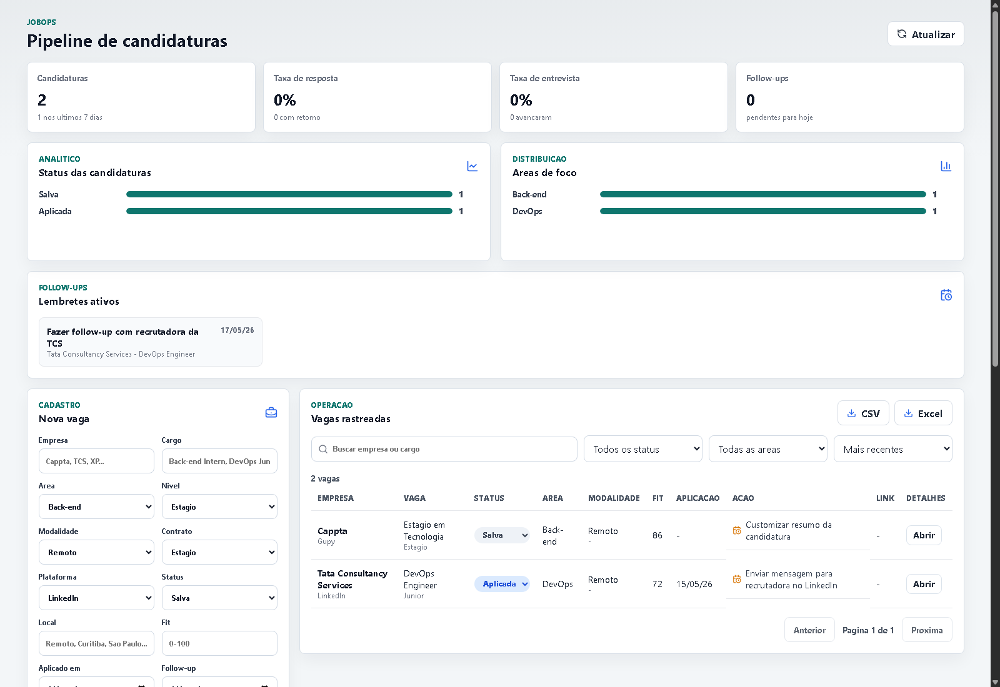
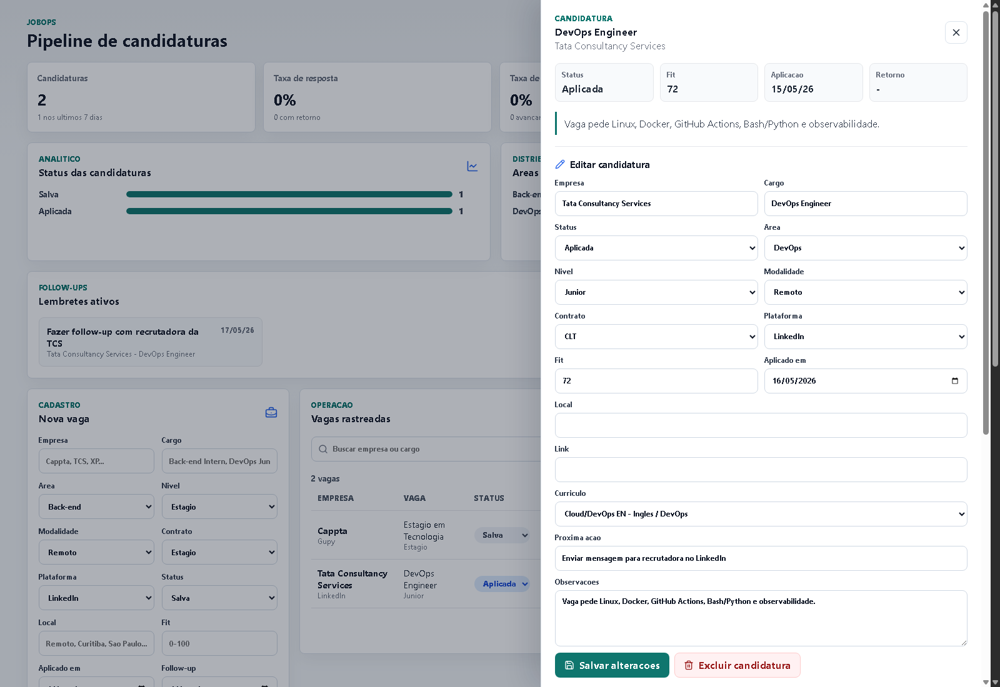

# JobOps

Gerenciador de candidaturas para acompanhar vagas, curriculos, contatos, retornos e metricas de busca de emprego.

## Objetivo

O JobOps nasceu para resolver uma dor real: organizar candidaturas de forma profissional e medir o que esta funcionando na busca por vagas.

Em vez de uma planilha solta, o sistema centraliza:

- vagas aplicadas;
- status de cada candidatura;
- curriculo usado;
- contatos com recrutadores;
- follow-ups;
- respostas e rejeicoes;
- metricas por area, plataforma, empresa e curriculo.

## Posicionamento tecnico

Projeto autoral focado em organizar uma dor real com uma stack de back-end e front-end moderna:

- API REST com Node.js, TypeScript e Express;
- PostgreSQL com Prisma;
- Frontend em React e TypeScript;
- Docker e Docker Compose para ambiente local;
- GitHub Actions para CI.

## Modulos do MVP

1. Dashboard de metricas
2. Cadastro e pipeline de vagas
3. Empresas e contatos
4. Versoes de curriculo
5. Historico de interacoes
6. Lembretes de follow-up

## Estrutura inicial

```text
jobops/
  apps/
    api/        # Backend Node.js/TypeScript
    web/        # Frontend React/TypeScript
  docs/         # Arquitetura, modelagem e planejamento
  infra/        # Docker e CI
```

## Status

Projeto em fase de MVP inicial com API e interface web.

## Screenshots

Dashboard principal com metricas, cadastro rapido, filtros, tabela de candidaturas e follow-ups:



Painel de detalhes da candidatura com historico de interacoes e lembretes de follow-up:



## Documentacao tecnica

- [Indice da documentacao](docs/INDEX.md)
- [Visao geral](docs/00-visao-geral.md)
- [Modelagem de dados](docs/01-modelagem-dados.md)
- [Roadmap](docs/02-roadmap.md)
- [API design](docs/03-api-design.md)
- [Fluxos de UI](docs/04-ui-fluxos.md)
- [DevOps](docs/05-devops.md)
- [Arquitetura backend](docs/06-backend-architecture.md)
- [Evidencias tecnicas](docs/07-evidencias-tecnicas.md)
- [Extra desktop](docs/08-desktop-extra.md)
- [Decisoes arquiteturais](docs/09-decisoes-arquiteturais.md)
- [Backlog priorizado](docs/10-backlog-priorizado.md)
- [Memoria de projeto](docs/11-memoria-de-projeto.md)

## Primeiros comandos

```bash
npm install
docker compose -f infra/docker-compose.yml up -d
npm run api:prisma:generate
npm run api:prisma:migrate
npm run api:prisma:seed
npm run api:test
npm run api:dev
```

API local:

```text
http://localhost:3333/api/health
```

Interface web:

```bash
npm run web:dev
```

```text
http://127.0.0.1:5173
```

## Extra: modo aplicativo desktop

Esta versao desktop e um extra opcional do JobOps, mantido no clone `jobops-desktop`. Ela nao substitui a versao web principal: apenas empacota o mesmo produto em uma janela propria no Windows usando Electron.

Ao abrir o app, ele sobe a API e a interface web por baixo, tenta abrir o Docker Desktop se ele estiver fechado e usa o PostgreSQL do `infra/docker-compose.yml`.

Criar atalho na Area de Trabalho:

```bash
npm run extra:desktop:shortcut
```

Abrir pelo terminal:

```bash
npm run extra:desktop:start
```

Depois de criar o atalho, basta abrir `JobOps` pela Area de Trabalho. O app fica rodando ate a janela ser fechada.

Os atalhos antigos `npm run desktop:start` e `npm run desktop:shortcut` continuam funcionando como alias.

Observacoes:

- o Docker Desktop precisa estar instalado;
- o primeiro boot pode demorar mais porque o banco, migrations e seed sao preparados;
- logs ficam em `jobops-desktop.log` na raiz do projeto.

## MVP atual

- API Express com TypeScript.
- Prisma schema para candidaturas, empresas, curriculos, interacoes e lembretes.
- Dashboard web com metricas, filtros, cadastro de vaga e tabela de acompanhamento.
- Docker Compose para PostgreSQL local.
- Arquitetura backend em camadas com routes, services, repositories e Prisma ORM.
- GitHub Actions com typecheck e build de API/Web.
- Listagem paginada, ordenavel e filtravel de candidaturas.
- Atualizacao rapida de status e geracao de lembretes de follow-up.
- Edicao completa e exclusao de candidaturas pela interface.
- CRUD visual de empresas e versoes de curriculo.
- Exportacao de candidaturas em CSV e Excel.
- Graficos simples por status e area de foco.
- Feedback visual para erros, carregamento e operacoes concluidas.
- Painel de detalhes para registrar interacoes, criar follow-ups e concluir lembretes.
- Testes unitarios e testes de integracao basicos para API.
